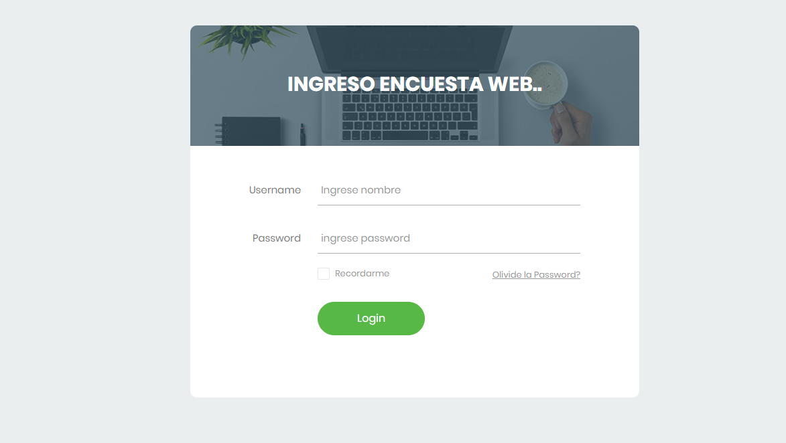
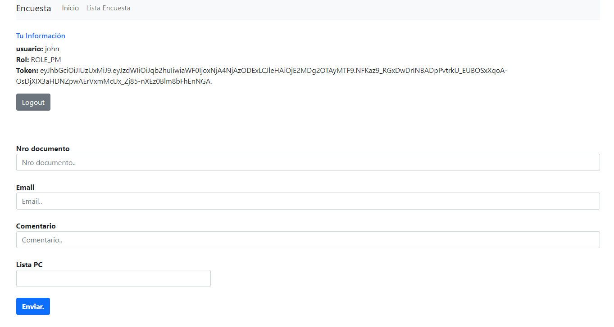
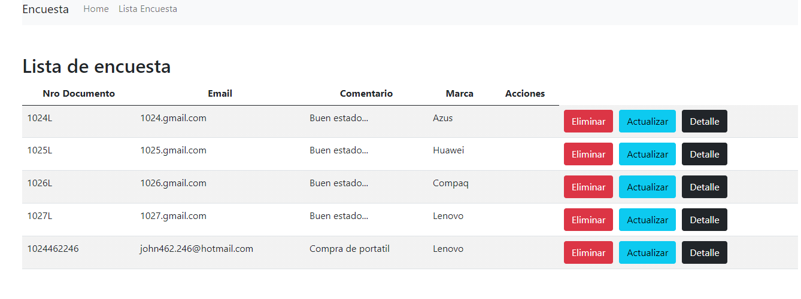

# REST Aplicacion Encuesta

> Implementacion en Spring boot, Mysql, Spring Security.                
(author : John Ochoa)

### Tabla de contenido

- [Registro encuesta](#Project-architecture)
- [Contacto](#contacto)

### Registro encuesta
 

### Tecnologias

- **Java 8**
- **Spring Boot** - version 2.1.5 RELEASE
- **Spring Web MVC** - version 5.1.7 RELEASE
- **Spring SESSION** - version 2.1.6 RELEASE
- **Spring Data JPA** - version 2.1.8 RELEASE 
- **Hibernate** - version 5.0.4 Finale
- **SQL Database engine** : Microsoft SQL 2016
- **NOSQL Database engine** : Redis 3.2.100
- **Maven**

### Administracion

1. **Administrator :**

   - Ver encuesta   
   - Eliminar encuesta   
   - Actualizar encuesta   

2. **Usuario** :

   - Registro
   
   
### Status:

**Application status :** BETA 

### Contacto:

Email : john@gmail.com
